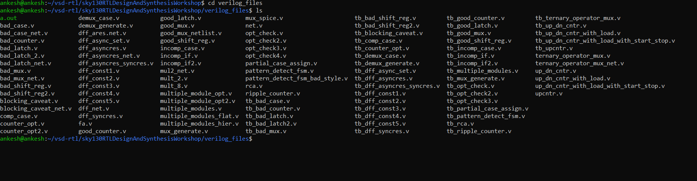
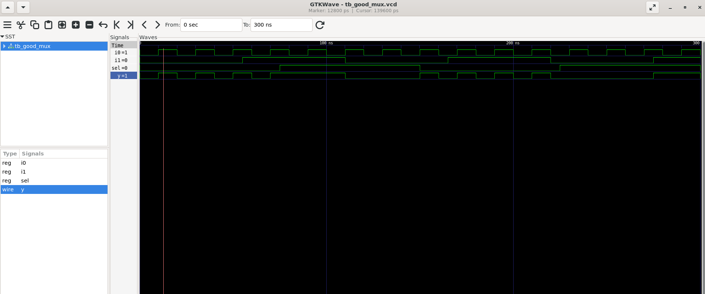
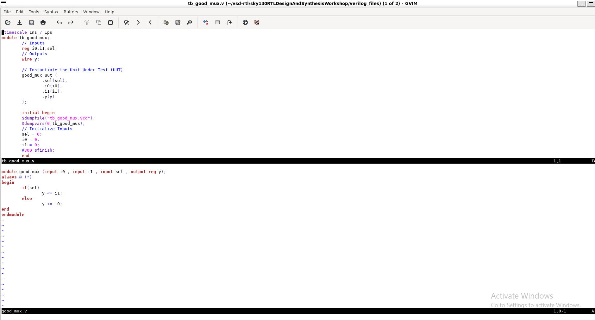
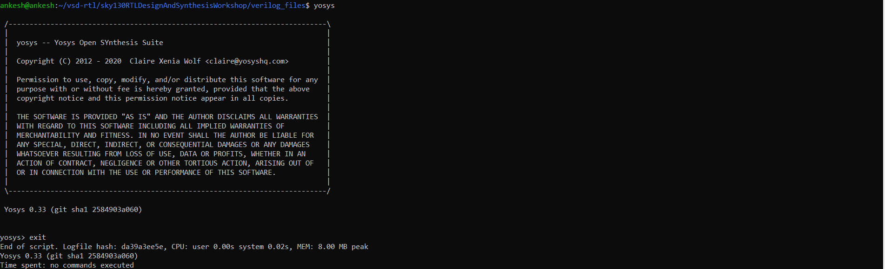
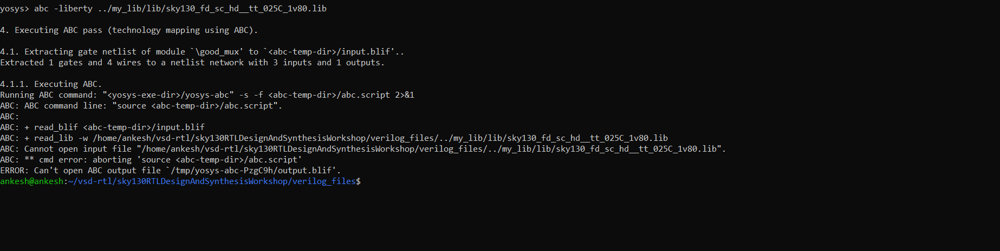
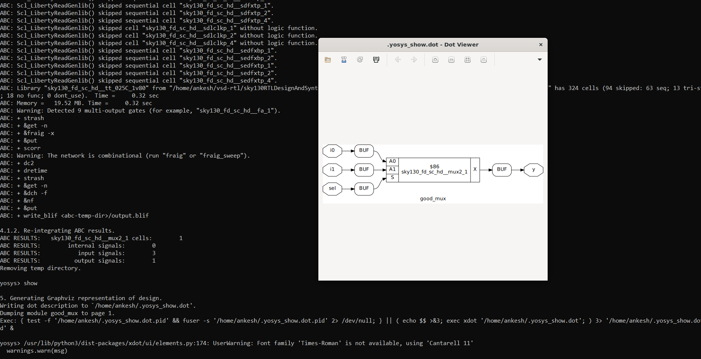
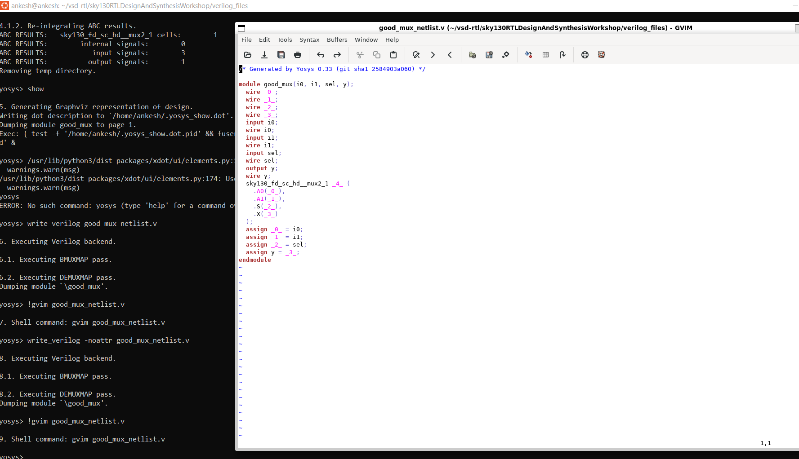

## Day 1 - Introduction to Verilog RTL Design and Synthesis

### 1. Git Setup
- Forked the repository on GitHub
- Cloned it to WSL:
```bash
git clone https://github.com/ankeshsingh00/vsd-rtl.git
```

### 2. Folder Structure
```
vsd-rtl/
└── sky130RTLDesignAndSynthesisWorkshop/
    ├── lib/          ← standard cell library
    ├── my_lib/
    │   └── verilog_model/
    ├── verilog_files/  ← all .v files
    └── yosys_run.sh
```

### 3. Basic Linux Commands Learned
| Command | What it does |
|---------|--------------|
| `cd foldername` | Enter a folder |
| `cd ..` | Go one level back |
| `cd ~` | Go to home |
| `ls` | List files |
| `ls -la` | List files with details |
| `pwd` | Show current location |
| `find` | Search for files |

### 4. Tool Installation
```bash
sudo apt update && sudo apt install iverilog
sudo apt install gtkwave
sudo apt install yosys
sudo apt install vim-gtk3
```

### 5. Simulation Flow with iverilog + GTKWave

**Step 1: Go to verilog files**
```bash
cd ~/vsd-rtl/sky130RTLDesignAndSynthesisWorkshop/verilog_files
```

**Step 2: Compile**
```bash
iverilog good_mux.v tb_good_mux.v
```

**Step 3: Simulate**
```bash
./a.out
```

**Step 4: View waveform**
```bash
gtkwave tb_good_mux.vcd
```

### Screenshots - Simulation


### 6. Synthesis Flow with Yosys

**Step 1: Open yosys**
```bash
yosys
```

**Step 2: Read library**
```bash
read_liberty -lib ../lib/sky130_fd_sc_hd__tt_025C_1v80.lib
```

**Step 3: Read verilog design**
```bash
read_verilog good_mux.v
```

**Step 4: Synthesize**
```bash
synth -top good_mux
```

**Step 5: Technology mapping**
```bash
abc -liberty ../lib/sky130_fd_sc_hd__tt_025C_1v80.lib
```

**Step 6: View schematic**
```bash
show
```

**Step 7: Write netlist**
```bash
write_verilog -noattr good_mux_netlist.v
```

**Step 8: View netlist in gvim**
```bash
!gvim good_mux_netlist.v
```

### Screenshots - Synthesis









### 7. Key Concepts Learned
| Concept | Meaning |
|---------|---------|
| RTL | Register Transfer Level - Verilog design |
| Testbench | File to test your design |
| `.vcd` file | Waveform file viewed in GTKWave |
| `.lib` file | Standard cell library |
| Synthesis | Converting RTL to gate level |
| Netlist | Gate level output after synthesis |
| `a.out` | Compiled simulation output |
| sky130 | Google/Skywater 130nm technology |

